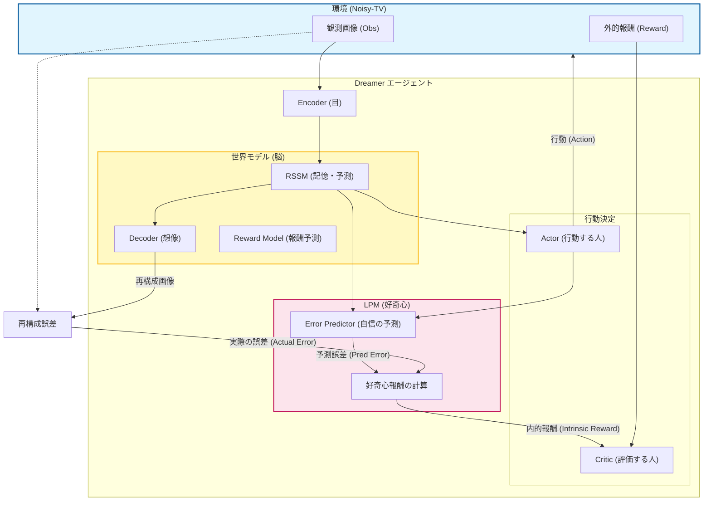

# LPM (Learning Progress Motivation) 実装ガイド

このリポジトリは、世界モデル **Dreamer** に **Learning Progress Motivation (LPM)** と呼ばれる好奇心に基づく探索手法を実装したものです。
特に、予測不可能なノイズ（Noisy-TV）が存在する環境下でも、効率的に探索を行うことを目的としています。

## 1. LPM (Learning Progress Motivation) とは？

通常のエージェントは「与えられた報酬」を最大化しようとしますが、報酬が疎（なかなか貰えない）な環境では学習が進みません。そこで「好奇心」という内部的な報酬を与えます。

- **従来の好奇心**: 「予測できないこと（予測誤差が大きいこと）」に興味を持つ。
  - 弱点: 砂嵐のようなランダムな映像（Noisy-TV）を見続けると、ずっと予測できないため、そこに釘付けになってしまう。
- **LPM (本実装)**: 「**予測誤差が減りそうなこと（学習が進みそうなこと）**」に興味を持つ。
  - 特徴: ランダムな映像は「予測できないし、これから学習しても予測できるようにならない」と判断し、無視できるようになる。

## 2. 学習しているタスクと環境 (Environment & Task)

**「Atari? MNIST? 何を学習しているの？」** という疑問にお答えします。

現在設定されている学習タスクは以下の通りです：

### A. メインタスク: `Pendulum-v1` (振り子)
- **目的**: 棒を振り上げて、逆立ちさせた状態で静止させること。
- **入力情報 (Observation)**:
  - 通常の強化学習では「棒の角度・角速度」などの数値データを使いますが、**Dreamerは「画像（ピクセル）」から学習します**。
  - そのため、振り子の描画画面（500x500）を **64x64ピクセルの画像** に縮小して入力しています。
- **行動 (Action)**: 左に力をかけるか、右に力をかけるか（連続値）。

### B. メインタスク2: `Craftium` (3D OpenWorld)
- **目的**: 3Dボクセル世界（Minetest）での自由探索およびアイテム収集。
- **入力情報**: 64x64ピクセルのRGB画像。
- **行動**: 移動、ジャンプ、採掘などの計17アクション。
- **特徴**: 無限生成される3D世界。タスク（外部報酬）が設定されていないため、好奇心のみで世界の法則を学ぶのに最適。

### □ サポートされている環境一覧 (`--env-name` で指定)

以下のコマンドで各タスクを実行できます。

```bash
# 基本形
docker compose exec lpm-dreamer xvfb-run -a python3 train_lpm.py --env-name <環境名> --steps 50000 --wandb
```

| 環境名 (指定用) | 特徴・タスク内容 | 開始装備 |
|:---|:---|:---|
| **`Craftium`**<br>(または `Craftium/OpenWorld-v0`) | **推奨.** 無限の3D世界での自由探索（VoxeLibreベース）。<br>特定のゴールはなく、LPMによる好奇心で世界の法則を学びます。 | 素手 |
| **`Craftium/ChopTree-v0`** | **木を切るタスク**。<br>木材を収集することを目的とします。 | 斧 (Axe) |
| **`Craftium/Speleo-v0`** | **洞窟探検タスク**。<br>地下空間を探索します。 | - |
| **`Craftium/SpidersAttack-v0`** | **戦闘タスク (vs クモ)**。<br>次々と現れる敵（クモ）を倒して生き残ります。 | 剣 (Sword) |
| **`Craftium/ProcDungeons-v0`** | **ダンジョン攻略タスク**。<br>自動生成されるダンジョンを探索し、敵を倒しながら奥へ進みます。 | 剣 (Sword) |
| `MountainCarContinuous-v0` | 谷を登る制御タスク。連続アクションのテスト用。 | - |
| `Pendulum-v1` | デフォルト。軽量な振り子タスク。 | - |

### C. 妨害要素: `CIFAR-10` (Noisy-TV)
- 探索能力を試すために、わざと**「魅力的なノイズ (Noisy-TV)」** を混ぜています。
- エージェントが特定の行動（激しく動くなど）をすると、画面が突然 **CIFAR-10データセットの画像（飛行機、鳥、猫などの写真）** に切り替わります。
- **なぜこれをするの？**:
  - 普通のエージェントは「おっ！見たことない絵が出た！面白い！」と勘違いして、棒を立てるのを忘れて「チャンネルザッピング（画像を切り替え続けること）」に夢中になってしまいます。
  - **LPMエージェント**は「この画像はランダムで予測不可能だし、学習しても無駄だ」と見抜いて、棒を立てる練習に戻れるはずです。

## 3. 実装内容 (What was implemented?)

今回の実装では、主に以下の2つのファイルを変更・作成しました。

### A. `student_code.py` (モデル定義)
Dreamerの各パーツ（世界モデルやポリシーなど）が定義されています。ここにLPM用のパーツを追加しました。

1.  **`ErrorPredictor` クラスの追加**:
    - 「現在の状態」と「行動」から、「次の瞬間の予測誤差（＝どれくらい予測を外しそうか）」を予測するニューラルネットワークです。
2.  **`Agent` クラスの更新**:
    - `ErrorPredictor` を持ち、学習時に使用できるようにしました。
    - 内部状態（RNNの隠れ状態など）を保持し、誤差計算に利用できるようにしました。

### B. `train_lpm.py` (学習スクリプト)
`Google Colab` 上のノートブックで行っていた学習プロセスを、ローカル環境でも実行可能なPythonスクリプトとして再現しました。

1.  **LPM学習ループの構築**:
    - 環境とやり取りし、データをバッファに保存。
    - バッファからデータを取り出し、Dreamer（世界モデル + Actor-Critic）と LPM（ErrorPredictor）を同時に学習させます。
    - **報酬の計算**: 環境からの報酬に加え、`eta * (予測した誤差 - 実際の誤差)` という好奇心報酬を加算しています。
2.  **Noisy-TV環境の構築 (`NoisyTVWrapperContinuous`)**:
    - エージェントが特定の行動（激しい操作など）をした時に、画面が「CIFAR-10のランダム画像」に切り替わる仕掛けを作りました。これが「魅力的なノイズ（テレビ）」の役割を果たします。

## 3. 実装アーキテクチャ (Architecture Detail)

エージェントは「世界モデル」を使って頭の中で未来を想像し、LPM（好奇心）によって「自分が成長できそうな場所」を探そうとします。



### 各パーツの役割

#### 1. 世界モデル (World Model) - 「脳」
エージェントの核となる部分です。過去の記憶を持ち、未来を予測します。

*   **Encoder (エンコーダ)**: 役割: 「目」。カメラからの画像（64x64ピクセル）を、コンピュータが扱いやすい数字の列（特徴量）に変換します。
*   **RSSM (Recurrent State Space Model)**: 役割: 「記憶と予測」。過去の情報を保持し、次の瞬間の状態を予測します。
*   **Decoder (デコーダ)**: 役割: 「想像」。脳内の状態から画像を逆に作り出します。

#### 2. 行動決定 (Actor-Critic) - 「意思」
*   **Actor (アクター)**: 現在の状態を見て最適な行動を選択します。
*   **Critic (クリティック)**: その行動の将来的な価値（報酬の総和）を予測します。

#### 3. LPM (Learning Progress Motivation) - 「好奇心」
今回の実装の目玉です。

*   **ErrorPredictor (エラー予測器)**:
    *   入力: 現在の状態 (`state` + `rnn_hidden`) + これから取る行動 (`action`)
    *   出力: **「次の瞬間の予測誤差」の予測値** (スカラー)
    *   **実装詳細**: 4層の全結合ニューラルネットワーク（MLP）で構成されています。活性化関数にはELUを使用しています。
        *   `Input -> Linear -> ELU -> Linear -> ELU -> Linear -> ELU -> Linear -> Output`
    *   意味: 「この行動をとったら、たぶんこれくらい予測を外しそうだな（＝難しそうだな）」という見積もりです。
    > [!NOTE]
    > **世界モデルとの違い**: Dreamerの世界モデル（RSSM）は「次の画像（未来）」そのものを生成・予測する確率モデルです。対してErrorPredictorは「世界モデルの予測がどれくらい外れるか（スカラー値）」を予測する単純な回帰モデル（ニューラルネット）であり、自身の能力をメタ認知する役割を持ちます。
*   **好奇心報酬の計算**:
    *   数式: `報酬 = η * (予測した誤差 - 実際の誤差)`
    *   **予測した誤差 (Pred Error)**: 「難しそうだな」という事前見積もり。
    *   **実際の誤差 (Actual Error)**: 実際にやってみて、どれくらい外したか。
    *   この差分が大きい（＝思ったよりうまく予測できた、あるいは学習効果が高かった）場合に、大きな報酬を与えます。
    *   **Noisy-TV対策**: 完全ランダムな映像は「実際に外れる」かつ「事前にも外れるとわかる」ため、差分が小さくなり、報酬が発生しにくくなります。

## 4. 学習プロセス (Training Process)

エージェントは、以下の3つのコンポーネントを **同じ学習ループ内で同時に学習** させ、常に自己改善（メタ学習）を繰り返します。

### A. 学習のステップ
1.  **環境とのインタラクション (Interaction)**
    *   エージェントが行動 (`env.step`) し、結果 (`next_obs`, `reward`) を得ます。
    *   このとき、LPMモジュールが「予測誤差」を計算し、**内的報酬 (Intrinsic Reward)** を環境報酬に加算します。
    *   データは `ReplayBuffer` に蓄積されます。

2.  **世界モデル & LPM の学習 (World Model & ErrorPredictor Update)**
    *   **世界モデル (RSSM & Decoder)**: 過去の画像系列を正しく復元・予測できるように学習します (`Obs_Loss`, `KL_Loss`)。
    *   **LPM (ErrorPredictor)**: 「次の瞬間の予測誤差」を正しく予測できるように学習します (`EP_Loss`)。
    *   これらは `wm_optimizer` によって一括で更新されます。これにより、世界モデルの成長に合わせて「好奇心の基準」もリアルタイムで更新されます。

3.  **行動決定器の学習 (Actor-Critic Update)**
    *   **Imagination (夢を見る)**: 学習した世界モデルを使って、頭の中で未来をシミュレーションします。
    *   **Actor (行動)**: シミュレーション上で **「環境報酬 + 好奇心報酬」** の合計が最大になるような行動を学習します。
    *   **Critic (価値判定制)**: その合計報酬の期待値を精度よく予測するように学習します。

### B. 学習のモニタリング (Monitoring)

WandB等で以下の指標を確認することで、各パートが正しく動いているか判断できます。

#### 1. 各指標の意味 (Metrics Definitions)

| 指標名 | 意味・解釈 |
|:---|:---|
| **`Train/WM_Loss`** | **世界モデルの「わからなさ」**。<br>観測損失 (`Obs`) + KL損失 (`KL`) + 報酬損失 (`Reward`) の合計。これが下がれば、モデルが世界を正しく理解しつつあります。 |
| **`Train/Obs_Loss`** | **画像の再構成誤差**。<br>「今見ているもの」を脳内でどれだけ正確に再現できるか。Dreamerの「視力」や「想像力」に相当します。 |
| **`Train/KL_Loss`** | **「予測」と「現実」のギャップ**。<br>これが低いと、過去の記憶だけで未来を正確に予測できています。 |
| **`Train/EP_Loss`** | **「自分の実力の見積もり」の失敗度合い**。<br>誤差予測器(EP)が「次はこれくらい予測を外すだろう」と予想した値と、実際の失敗量のズレ。 |
| **`LPM/Intrinsic_Reward`** | **好奇心報酬** (`Pred_Error(対数) - Actual_Error(対数)`)。<br>「思ったより上手くできた（予測誤差が小さかった）」ときにプラスになります。 |
| **`LPM/Actual_Error`** | **実際の予測失敗量**。<br>世界モデルがどれくらい未来予測を間違えたか。**これが下がることが学習の第一目標です**。 |

#### 2. LPMの学習サイクル: 「習熟の喜び」と「退屈」

LPMの特徴的な挙動として、報酬が一時的に高止まりし、その後に下がる現象が見られます。これはバグではなく、正常な学習プロセスです。

1.  **習熟への喜び (Joy of Mastery)**
    *   **現象**: 世界モデル (WM) が急に賢くなり、予測誤差 (`Actual`) がドンと下がる。しかし、誤差予測器 (EP) はまだ「難しいはずだ」と思っているため、大きなプラスの報酬が発生する (`Pred > Actual`)。
    *   **効果**: エージェントは「ここは急に予測できるようになった！楽しい！」と感じ、**しばらくその場所に留まって学習を定着させようとします**。

2.  **退屈 (Boredom)**
    *   **現象**: 同じ場所に留まっていると、遅れて学習していた EP がやがて追いつき、「ここはもう簡単だ」と正確に見積もれるようになる。すると報酬 (`Pred - Actual`) がゼロに近づく。
    *   **効果**: エージェントは「ここはもう完全に理解した（飽きた）」と感じ、**新しい未知の場所へと移動を開始します**。

> [!NOTE]
> 誤差予測器 (EP) の学習が遅れることは意図的な設計です。EPが速すぎると、理解が定着する前に「飽きた」と判断してしまい、浅い学習になってしまうためです。

ターミナルで以下のコマンドを実行してください。

```bash
# Pendulum (標準)
python3 train_lpm.py --steps 10000 --noisy-tv

# Craftium (3D世界探索 - 推奨)
# ※Xvfb環境下で実行してください
xvfb-run -a python3 train_lpm.py --env-name Craftium --steps 50000

# 別のサンプル環境
python3 train_lpm.py --env-name MountainCarContinuous-v0 --steps 20000 --noisy-tv
```

### 主なオプション引数
- `--steps`: 学習を行う総ステップ数（デフォルト: 200,000）
- `--noisy-tv`: 指定するとNoisy-TV（ランダム画像による妨害）が有効になります。指定しないと通常の環境になります。
- `--seed`: ランダムシード値（再現性確保のため）
- `--env-name`: 環境名（現在はコード内で `Pendulum-v1` ベースに固定されていますが、引数としては残しています）

実行すると、学習済みモデルが `agent_lpm.pth` として保存されます。

### 学習状況の可視化 (Visualization)
学習中、定期的に評価（Evaluation）が行われ、その際のエージェントの動きが動画として保存されます。
- **保存場所**: `videos/` ディレクトリ
- **ファイル名**: `eval_iter_{step}_ep_0.mp4` (ステップ数ごとの動画)

### 実験のポイント (Tips)

#### なぜ LPM なのか？
LPMがない（ただの予測誤差やランダム探索）場合、エージェントはNoisy-TV（ランダム画像）に引っかかり続けます。
LPMがあると、「Noisy-TVは予測できないけれど、学習しても予測できるようにならない（進歩がない）」と気づき、飽きて（Learning Progressが低下して）別の行動（棒を立てるなど）に移ります。

Logsを確認する際は、`Train/EP_Loss` (ErrorPredictorの精度) や `Train/Intr_Reward_Mean` (好奇心報酬の量) に注目してください。
Noisy-TVを見ているときは Intr_Reward が最初は高いかもしれませんが、すぐに下がっていくはずです。
学習曲線（報酬の推移など）をグラフで見たい場合は、WandBを使用できます。

```bash
# WandBを使って実行
python3 train_lpm.py --steps 10000 --noisy-tv --wandb --wandb-project "Dreamer-LPM"
```
- 初回実行時にAPIキーの入力が求められます（または `export WANDB_API_KEY=your_key` で設定）。

- 初回実行時にAPIキーの入力が求められます（または `export WANDB_API_KEY=your_key` で設定）。

## 5. 検証と可視化 (Verification & Visualization)

LPMが正しく機能しているか（＝ノイズを無視できているか）を確認するためのツールを用意しました。

### ステップ 1: Noisy-TV環境で学習を実行
まず、ノイズがある環境でデータを収集します。

```bash
python3 train_lpm.py --steps 5000 --noisy-tv
```

実行すると、学習ログが `lpm_stats.csv` というファイルに自動的に保存されます。
このファイルには、「実際の予測誤差」「ErrorPredictorの予測値」「内発的報酬」「ノイズの有無」が記録されています。

### ステップ 2: グラフを作成
付属のスクリプトを実行して、可視化グラフを生成します。

```bash
python3 plot_lpm_analysis.py
```

`plots/` ディレクトリに以下の画像が生成されます：

1.  **`reward_over_time.png` (報酬の推移)**
    - **Noisy State Reward (赤)**: ノイズ画像に対する内発的報酬。
    - **Clean State Reward (青)**: 通常画像に対する内発的報酬。
    - **理想的な動き**: 学習が進むにつれて、「赤線（ノイズ）」が下がり、「青線」より低くなる、あるいはゼロに近づくはずです。これは「ノイズは予測できないし、学習しても無駄だ」とエージェントが理解したことを意味します。

2.  **`error_correlation.png` (誤差の相関)**
    - 横軸：実際の予測誤差 (Actual Error)
    - 縦軸：予測した誤差 (Predicted Error)
    - ErrorPredictorが正しく学習できていれば、点が対角線（点線）に沿って並びます。

3.  **`error_distribution.png` (誤差分布)**
    - ノイズ画像と通常画像の、実際の予測誤差のヒストグラムです。
    - ノイズ画像のほうが圧倒的に誤差が大きい（右側に分布する）ことが確認できます。

## 6. Dockerでの実行方法 (Run with Docker)

他のマシンでも同じ環境で実行できるように、Docker環境を用意しました。

### 必要なもの
- Docker
- Docker Compose
- NVIDIA Driver / NVIDIA Container Toolkit (GPUを使う場合)

### 実行手順

1. **コンテナのビルドと起動**
   付属のスクリプトを使うと簡単です。
   ```bash
   chmod +x start.sh
   ./start.sh
   ```
   これでコンテナが立ち上がり、自動的にコンテナの中に入ります。

2. **コンテナ内での学習実行**
   ```bash
   # コンテナ内で
   python3 train_lpm.py --steps 10000 --noisy-tv
   ```

3. **終了方法**
   `exit` でコンテナから抜けられます。コンテナ自体を停止するには `docker-compose down` を実行してください。

## 7. ファイル構成仕様書 (File Specifications)

開発者が変更を加える際のガイドです。「何を変えたい時に、どのファイルをどうすればいいか」をまとめています。

| ファイル名 | 役割 (Role) | 変更すると何が変わる？ (Effect of Change) | 実行コマンド |
|:---|:---|:---|:---|
| **`train_lpm.py`** | **学習実行スクリプト**<br>(練習メニュー) | ・学習の回数、バッチサイズ<br>・使用する環境 (Pendulumなど)<br>・報酬計算式 (LPMの係数ηなど)<br>・WandBのログ設定 | `python3 train_lpm.py` |
| **`student_code.py`** | **モデル定義**<br>(脳みそ・身体) | ・ニューラルネットの構造 (層の数、広さ)<br>・世界モデル(RSSM)の挙動<br>・好奇心(ErrorPredictor)の予測ロジック | 直接実行はしない<br>(importされる) |
| **`exploration/`** | **補助ツール** | ・Noisy-TVの画像生成ロジック (`cifar.py`)<br>・環境のラッパー (`noisy_wrapper.py`) | (importされる) |
| **`Dockerfile`** | **環境定義** | ・インストールされるライブラリ<br>・Pythonのバージョン | `docker build` |
| **`train_lpm.py`** | **学習実行スクリプト**<br>(練習メニュー) | ・学習の回数、バッチサイズ<br>・使用する環境 (Pendulumなど)<br>・報酬計算式 (LPMの係数ηなど)<br>・WandBのログ設定 | `python3 train_lpm.py` |
| **`student_code.py`** | **モデル定義**<br>(脳みそ・身体) | ・ニューラルネットの構造 (層の数、広さ)<br>・世界モデル(RSSM)の挙動<br>・好奇心(ErrorPredictor)の予測ロジック | 直接実行はしない<br>(importされる) |
| **`exploration/`** | **補助ツール** | ・Noisy-TVの画像生成ロジック (`cifar.py`)<br>・環境のラッパー (`noisy_wrapper.py`) | (importされる) |
| **`plot_lpm_analysis.py`**| **可視化ツール** | ・`lpm_stats.csv` を読み込んでグラフを描画する | `python3 plot_lpm_analysis.py` |
| **`Dockerfile`** | **環境定義** | ・インストールされるライブラリ<br>・Pythonのバージョン | `docker build` |
| **`start.sh`** | **起動スクリプト** | ・Docker起動時のオプション<br>・マウントするフォルダ設定 | `./start.sh` |

### よくある変更パターン

#### パターンA: 「ハイパーパラメータを変えたい」
- **対象**: `train_lpm.py` の `Config` クラス
- **操作**: `self.lpm_eta = 1.0` などを書き換える。

#### パターンB: 「新しい環境 (CartPoleなど) で試したい」
- **対象**: `train_lpm.py` の `make_env_simple` 関数
- **操作**: `gym.make("Pendulum-v1")` を `gym.make("CartPole-v1")` に変える。
- **注意**: 画像サイズを `(64,64)` に合わせるための `ResizeObservation` が必要。

#### パターンC: 「新しい脳みそ (Transformerなど) を試したい」
- **対象**: `student_code.py`
- **操作**: `RSSM` クラスや `ErrorPredictor` クラスの中身を書き換える。書き換えた後は `train_lpm.py` を再実行すれば反映されます。

性能を向上させたり、別の実験を行いたい場合のアドバイスです。

### Q1. 好奇心の強さを変えたい
**変更ファイル**: `train_lpm.py`
**変更箇所**: `Config` クラス内の `self.lpm_eta`
- 値を **大きく** する (例: 1.0 -> 5.0) → 好奇心旺盛になり、探索を重視します（脱線もしやすくなります）。
- 値を **小さく** する (例: 1.0 -> 0.1) → タスク達成（棒を立てるなど）を重視し、探索をあまりしなくなります。

### Q2. 精度をもっと上げたい（モデルの改良）
**変更ファイル**: `student_code.py`
**変更箇所**: 各クラス（`Encoder`, `RSSM`, `Actor`, `ErrorPredictor` など）の `hidden_dim`（層の広さ）やネットワーク構造
- より複雑な環境に対応するには、ニューラルネットワークのパラメータ数を増やす（層を深くする、ユニット数を増やす）のが有効です。
- ただし、計算時間が長くなります。

### Q3. 別の環境で試したい
**変更ファイル**: `train_lpm.py`
**変更箇所**: `make_env_simple` 関数
- 現在は `Pendulum-v1` を画像ベース(`RenderWrapper`)で使用しています。
- `gym.make("CartPole-v1", ...)` などに変更することで、他の環境でも実験できます。
- **注意**: Dreamerは画像入力を前提としているため、`ResizeObservation((64, 64))` などで画像サイズを合わせる必要があります。

### Q4. 学習時間を短縮したい（デバッグ用）
**変更ファイル**: `train_lpm.py`
**変更箇所**: `Config` クラス
- `self.batch_size` を小さくする（メモリ節約）。
- `self.seq_length` を短くする（1回の学習で見る系列長を減らす）。

---

### ファイル構成
- `student_code.py`: エージェントとモデルの定義（ここをいじると脳みそが変わる）
- `train_lpm.py`: 学習の実行スクリプト（ここをいじると練習メニューが変わる）
- `exploration/`: データセット読み込みなどの補助ツール
